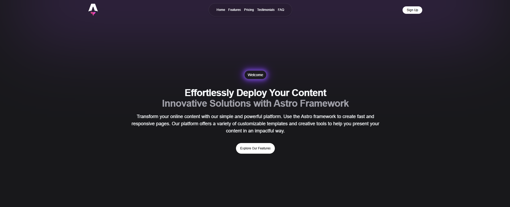

# 🚀 Astro Landing Page

Modern free Tailwind CSS, Astro landing page template for startups



## Project Structure

Inside of your Astro project, you'll see the following folders and files:

```text
/
├── public/
│ └── favicon.svg
├── src/
│ ├── components/
│ │ └── ui/
│ │ ├── Accordion.astro
│ │ ├── Button.astro
│ │ ├── CardsFeatures.astro
│ │ ├── PricingCards.astro
│ │ ├── TestimonialsCards.astro
│ │ ├── Faq.astro
│ │ ├── Features.astro
│ │ ├── Footer.astro
│ │ ├── Hero.astro
│ │ ├── Navbar.astro
│ │ ├── Partner.astro
│ │ ├── Pricing.astro
│ │ ├── Testimonials.astro
│ │ └── Trusted.astro
│ ├── layouts/
│ │ └── mainLayout.astro
│ └── pages/
│ └── index.astro
└── package.json
```

Astro looks for `.astro` or `.md` files in the `src/pages/` directory. Each page is exposed as a route based on its file name.

There's nothing special about `src/components/`, but that's where we like to put any Astro/React/Vue/Svelte/Preact components.

Any static assets, like images, can be placed in the `public/` directory.

## 🧞 Commands

All commands are run from the root of the project, from a terminal:

| Command                   | Action                                           |
| :------------------------ | :----------------------------------------------- |
| `npm install`             | Installs dependencies                            |
| `npm run dev`             | Starts local dev server at `localhost:4321`      |
| `npm run build`           | Build your production site to `./dist/`          |
| `npm run preview`         | Preview your build locally, before deploying     |
| `npm run astro ...`       | Run CLI commands like `astro add`, `astro check` |
| `npm run astro -- --help` | Get help using the Astro CLI                     |

## 👀 Want to learn more?

Feel free to check [our documentation](https://docs.astro.build) or jump into our [Discord server](https://astro.build/chat).
